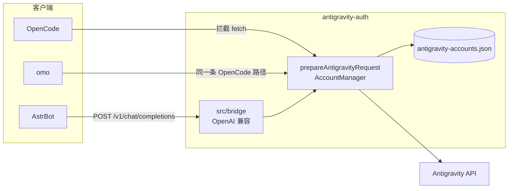
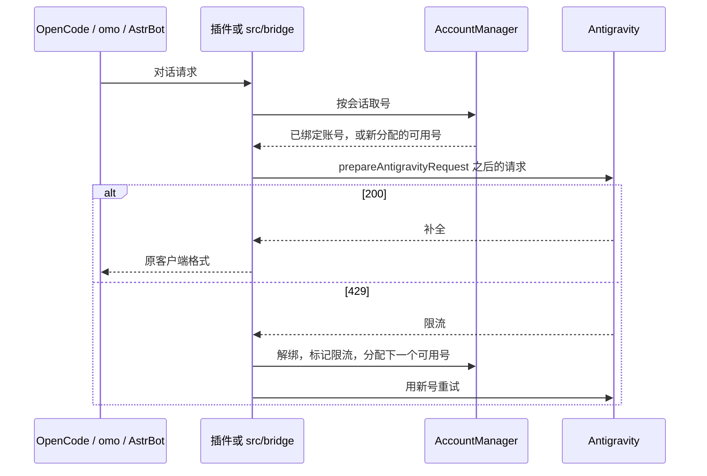
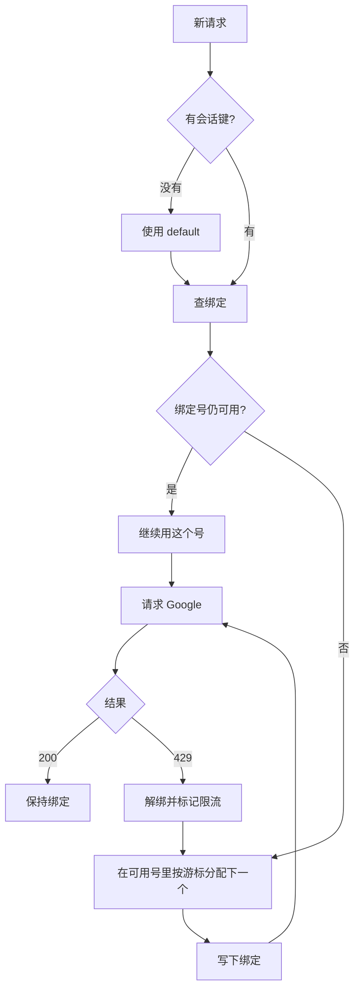
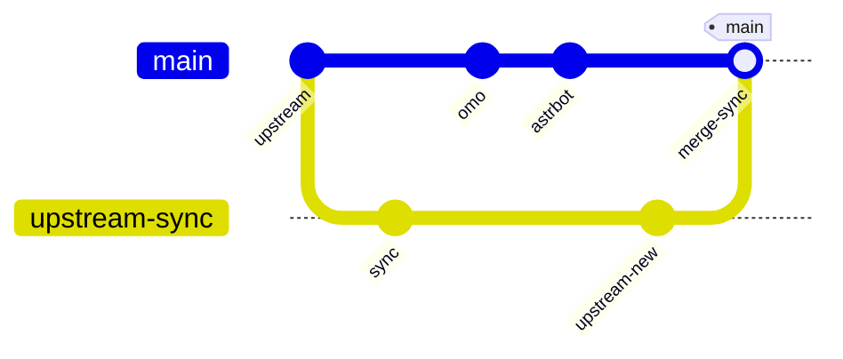

# antigravity-auth

OpenCode、omo、AstrBot 共用同一套 Antigravity 号池。协议转换、账号刷新和轮换只写一次，在本仓库的 TypeScript 里。AstrBot 不重写协议，只通过本机 OpenAI 兼容桥调用它。

包名是 `antigravity-auth`。GitHub 仓库目前仍是 [wedreamer/opencode-antigravity-auth](https://github.com/wedreamer/opencode-antigravity-auth)。本机没有 `gh` 登录，远程仓库名还没改。改名命令：

```bash
gh repo rename antigravity-auth
```

改名完成后，下面的安装地址把仓库名换成 `antigravity-auth`。

上游是 [JoshRob297/opencode-antigravity-auth](https://github.com/JoshRob297/opencode-antigravity-auth)。更早的归档仓库是 [NoeFabris/opencode-antigravity-auth](https://github.com/NoeFabris/opencode-antigravity-auth)。

## 三条用法

| 客户端 | 接入方式 | 你要配的地址 |
| --- | --- | --- |
| OpenCode | 插件拦截发往 `generativelanguage.googleapis.com` 的 `fetch` | 不填 API 地址。装插件后 `opencode auth login` |
| omo | 同一套 OpenCode 插件。关掉 omo 自带的 Google auth，避免两套登录抢请求 | 模型写 `google/antigravity-gemini-3.8-flash` |
| AstrBot | Python 插件把对话打到本机桥，桥再进号池 | `api_base` 默认 `http://127.0.0.1:18765/v1` |

omo 没有单独的协议。它就是装了 oh-my-opencode 的 OpenCode。

## 架构



OpenCode / omo 的请求本来就是 Gemini API 形状。插件把它改写成 Antigravity Cloud Code 请求，带上号池里的 access token、项目号和指纹。

AstrBot 说的是 OpenAI Chat Completions。`src/bridge` 先把消息译成 Gemini `generateContent`，再调用同一个 `prepareAntigravityRequest`。Python 插件不保存 refresh token，也不自己拼 Google 协议。



## 号池

账号文件：`~/.config/opencode/antigravity-accounts.json`。OpenCode 登录写入的就是这个文件，AstrBot 读同一个文件。



规则：

- 多个号都会用。新会话从当前可用号里按顺序分配，不会所有人挤在一个号上。
- 同一个会话粘在分到的号上。OpenCode 用自身会话。AstrBot 把 `session_id`（没有则用 `conversation_id` 或 `umo`）放到 `x-session-id` 和 OpenAI 的 `user`。
- 该号返回 429 才解绑，再分下一个可用号，之后粘在新号上。
- 响应头 `x-antigravity-account` 是号的序号，不是邮箱。

## 分支



| 分支 | 作用 |
| --- | --- |
| `main` | 产品分支。OpenCode / omo 插件和 AstrBot 适配都在这里。 |
| `upstream-sync` | 跟踪 `upstream/main`（JoshRob297）。只用来同步上游，不在这上面做 omo 或 AstrBot 功能。 |

```bash
git checkout upstream-sync
git pull
git checkout main
git merge upstream-sync
```

`upstream` 远程是 `https://github.com/JoshRob297/opencode-antigravity-auth.git`。

## OpenCode

写入 `~/.config/opencode/opencode.json`：

```json
{
  "plugins": ["github:wedreamer/opencode-antigravity-auth"]
}
```

然后：

```bash
opencode auth login
```

选择 Google，再选 OAuth with Google (Antigravity)。OpenCode v2 会自动登记模型和思考档位。

```bash
opencode run "Hello" --model=google/antigravity-gemini-3.8-flash --variant=high
```

本地开发：

```bash
git clone https://github.com/wedreamer/opencode-antigravity-auth.git
cd opencode-antigravity-auth
npm install && npm run build
```

`opencode.json` 里把插件写成这个目录的绝对路径。

## omo

omo 走上面的 OpenCode 插件。必须关掉它自己的 Google 登录，否则两套认证会抢同一个请求。

`~/.config/opencode/oh-my-opencode.json`：

```json
{
  "google_auth": false,
  "agents": {
    "document-writer": { "model": "google/antigravity-gemini-3.8-flash" }
  }
}
```

模型名用 `google/antigravity-...`，不要再填一套 API key。

## AstrBot

桥先在本仓库启动：

```bash
npm install
npm run bridge
```

默认只听 `127.0.0.1:18765`，令牌是 `local`。健康检查：

```bash
curl -sS http://127.0.0.1:18765/health
```

返回 `{"ok":true,"proxy":false}`。带了出网代理时 `proxy` 为 `true`。

插件安装：把 `astrbot_plugin_antigravity/` 拷进 AstrBot 的 `data/plugins/`，或执行 `npm run pack:astrbot` 后把 `dist/astrbot_plugin_antigravity.zip` 上传到插件页。zip 里没有桥，桥必须在能读到号池文件的机器上跑。

到「模型提供商 → 对话 → 新增」，选 **Antigravity Gemini Pool**。

| 字段 | 同机 | AstrBot 在 Docker、桥在宿主机 |
| --- | --- | --- |
| `api_base` | `http://127.0.0.1:18765/v1` | `http://host.docker.internal:18765/v1` |
| `key` | `local`，或与 `--token` 相同 | 与桥的 `--token` 相同 |
| `proxy` | 留空，或 `http://127.0.0.1:7890` | 留空。代理配在宿主机的桥上 |
| `bridge_bind` | `127.0.0.1` | 宿主机用 `--host 0.0.0.0` |
| `accounts_path` | `~/.config/opencode/antigravity-accounts.json` | 桥所在机器上的路径 |
| `repo_path` | 仓库绝对路径。桥已手动跑着就留空 | 留空 |
| 模型 | `gemini-3.8-flash` | 同左 |

保存后，到「配置文件 → AI 配置 → 模型」，把对话模型设成这个提供商。

`proxy` 只给桥访问 Google。插件访问 `api_base` 时不走这个代理。只支持 `http://` 代理，不支持 `socks5://`。Clash 用它的 HTTP 端口。

Docker 或要给别的机器访问时：

```bash
npm run bridge -- --host 0.0.0.0 --port 18765 --token local
npm run bridge -- --host 0.0.0.0 --proxy http://127.0.0.1:7890
```

`--host 0.0.0.0` 会把桥暴露到本机网络。把 `--token` 换成只有你知道的字符串，并在提供商的 `key` 里填同一个值。

更细的步骤在 [astrbot_plugin_antigravity/README.md](astrbot_plugin_antigravity/README.md)。

## 模型

| 模型 | 档位 | 说明 |
| --- | --- | --- |
| `antigravity-gemini-3.8-flash` | low / medium / high | OpenCode 默认 Flash |
| `antigravity-gemini-3.7-flash` | low / medium / high | Flash |
| `antigravity-gemini-3.6-flash` | low / medium / high | Flash |
| `antigravity-gemini-3.1-pro` | low / high | Pro |
| `gemini-3.8-flash` | 桥内默认 low | AstrBot / OpenAI 兼容桥使用的短名 |

OpenCode 模型带 `antigravity-` 前缀。桥接受带或不带这个前缀的名字，后端会解析成 `gemini-3.8-flash-low` 这类 id。

## 继续看

- 配置项：[docs/CONFIGURATION.md](docs/CONFIGURATION.md)
- 排障：[docs/TROUBLESHOOTING.md](docs/TROUBLESHOOTING.md)
- 变更记录：[CHANGELOG.md](CHANGELOG.md)
