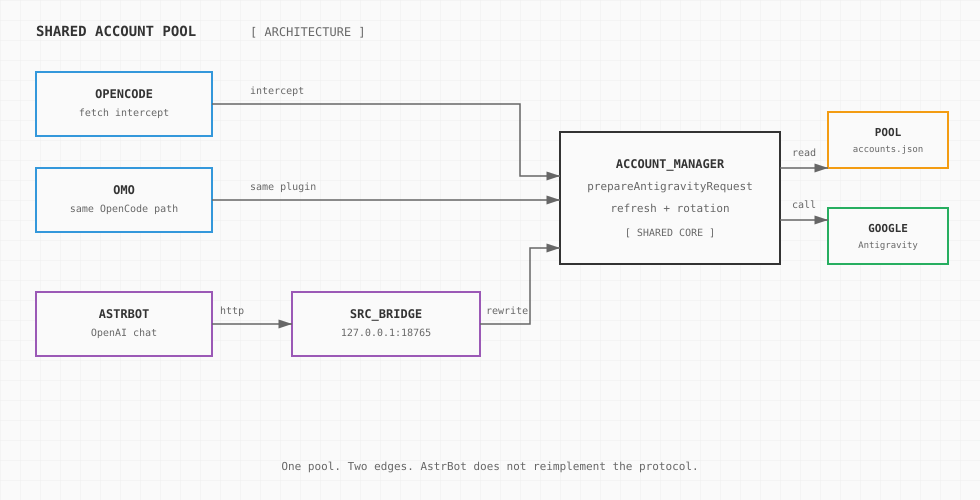
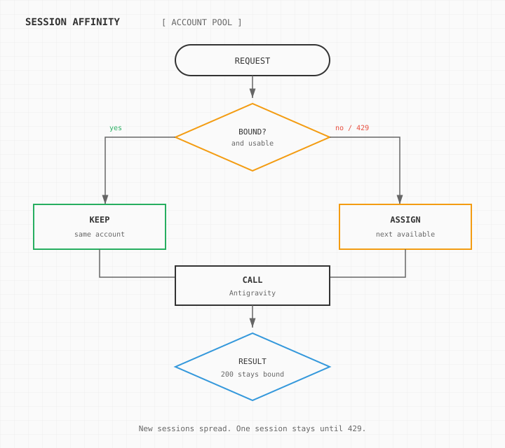
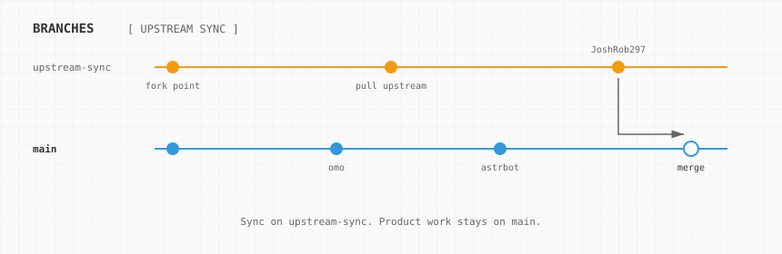

# antigravity-auth

English | [简体中文](README.zh-CN.md)

OpenCode, omo, and AstrBot share one Antigravity account pool. Protocol rewrite, token refresh, and rotation live once, in this repository's TypeScript. AstrBot does not reimplement the protocol. It calls a local OpenAI-compatible bridge.

The package name is `antigravity-auth`. The GitHub repository is [wedreamer/antigravity-auth](https://github.com/wedreamer/antigravity-auth). The old `opencode-antigravity-auth` name redirects there.

Upstream is [JoshRob297/opencode-antigravity-auth](https://github.com/JoshRob297/opencode-antigravity-auth). The archived original is [NoeFabris/opencode-antigravity-auth](https://github.com/NoeFabris/opencode-antigravity-auth).

## Three clients

| Client | How it connects | What you configure |
| --- | --- | --- |
| OpenCode | The plugin intercepts `fetch` to `generativelanguage.googleapis.com` | No API base URL. Run `opencode auth login` after install |
| omo | The same OpenCode plugin. Turn off omo's own Google auth so the two logins do not fight | Model `google/antigravity-gemini-3.8-flash` |
| AstrBot | A Python plugin posts chat to the local bridge, and the bridge enters the pool | `api_base` defaults to `http://127.0.0.1:18765/v1` |

omo is not a third protocol. It is OpenCode with oh-my-opencode.

## Architecture



OpenCode and omo already speak the Gemini API shape. The plugin rewrites that into an Antigravity Cloud Code request, with the pool's access token, project id, and fingerprint.

AstrBot speaks OpenAI Chat Completions. `src/bridge` translates messages into a Gemini `generateContent` body, then calls the same `prepareAntigravityRequest`. The Python plugin does not store refresh tokens and does not assemble the Google protocol.



## Account pool

Account file: `~/.config/opencode/antigravity-accounts.json`. OpenCode login writes it. AstrBot reads the same file.

- Every enabled account can be used. A new session takes the next available account, so traffic does not pile onto one account.
- A session sticks to the account it was given. OpenCode uses its own session. AstrBot sends `session_id` (or `conversation_id` / `umo`) as `x-session-id` and the OpenAI `user` field.
- A 429 unbinds that session, marks the account limited, and assigns the next available account. Later turns stick to the new account.
- The `x-antigravity-account` response header is an account index, not an email.

## Branches



| Branch | Role |
| --- | --- |
| `main` | Product branch. OpenCode / omo plugin and the AstrBot adapter both live here. |
| `upstream-sync` | Tracks `upstream/main` (JoshRob297). Use it only to sync upstream. Do not add omo or AstrBot features on it. |

```bash
git checkout upstream-sync
git pull
git checkout main
git merge upstream-sync
```

The `upstream` remote is `https://github.com/JoshRob297/opencode-antigravity-auth.git`.

## OpenCode

Add this to `~/.config/opencode/opencode.json`:

```json
{
  "plugins": ["github:wedreamer/antigravity-auth"]
}
```

The old install URL `github:wedreamer/opencode-antigravity-auth` still redirects, but new configs should use the name above.

Then:

```bash
opencode auth login
```

Choose Google, then OAuth with Google (Antigravity). OpenCode v2 registers models and thinking tiers.

```bash
opencode run "Hello" --model=google/antigravity-gemini-3.8-flash --variant=high
```

Local development:

```bash
git clone git@github.com:wedreamer/antigravity-auth.git
cd antigravity-auth
npm install && npm run build
```

Point `opencode.json` at that directory's absolute path while developing.

## omo

omo uses the OpenCode plugin above. Disable its built-in Google login, or the two auth layers will compete for the same request.

`~/.config/opencode/oh-my-opencode.json`:

```json
{
  "google_auth": false,
  "agents": {
    "document-writer": { "model": "google/antigravity-gemini-3.8-flash" }
  }
}
```

Use model ids `google/antigravity-...`. Do not add a second API key.

## AstrBot

Start the bridge from this repository:

```bash
npm install
npm run bridge
```

It listens on `127.0.0.1:18765` by default. The token is `local`. Health check:

```bash
curl -sS http://127.0.0.1:18765/health
```

`{"ok":true,"proxy":false}` means the bridge is up without an outbound proxy. `proxy` is `true` when the bridge was started with `--proxy`.

Install the plugin by copying `astrbot_plugin_antigravity/` into AstrBot `data/plugins/`, or run `npm run pack:astrbot` and upload `dist/astrbot_plugin_antigravity.zip`. The zip does not contain the bridge. The bridge must run on a machine that can read the account file.

In the WebUI, open Model Providers, add **Antigravity Gemini Pool**.

| Field | Same machine | AstrBot in Docker, bridge on the host |
| --- | --- | --- |
| `api_base` | `http://127.0.0.1:18765/v1` | `http://host.docker.internal:18765/v1` |
| `key` | `local`, or the same value as `--token` | Same as the bridge `--token` |
| `proxy` | Empty, or `http://127.0.0.1:7890` | Empty. Set the proxy on the host bridge |
| `bridge_bind` | `127.0.0.1` | Host starts with `--host 0.0.0.0` |
| `accounts_path` | `~/.config/opencode/antigravity-accounts.json` | Path on the machine that runs the bridge |
| `repo_path` | Absolute path of this repo. Leave empty if the bridge is already running | Leave empty |
| Model | `gemini-3.8-flash` | Same |

Save the provider, then set the conversation model to it under Config, AI, Model.

`proxy` is only for the bridge's calls to Google. The plugin does not send `api_base` through that proxy. Only `http://` proxies are supported, not `socks5://`. If you use Clash, use its HTTP port.

When AstrBot is in Docker, or another machine must reach the bridge:

```bash
npm run bridge -- --host 0.0.0.0 --port 18765 --token local
npm run bridge -- --host 0.0.0.0 --proxy http://127.0.0.1:7890
```

`--host 0.0.0.0` exposes the bridge on the local network. Change `--token` to a private string and put the same string in the provider `key`.

Step-by-step notes: [astrbot_plugin_antigravity/README.md](astrbot_plugin_antigravity/README.md).

## Models

| Model | Tiers | Notes |
| --- | --- | --- |
| `antigravity-gemini-3.8-flash` | low / medium / high | Default Flash for OpenCode |
| `antigravity-gemini-3.7-flash` | low / medium / high | Flash |
| `antigravity-gemini-3.6-flash` | low / medium / high | Flash |
| `antigravity-gemini-3.1-pro` | low / high | Pro |
| `gemini-3.8-flash` | bridge defaults to low | Short name used by AstrBot and the OpenAI bridge |

OpenCode model ids use the `antigravity-` prefix. The bridge accepts that prefix or the short name. The backend id looks like `gemini-3.8-flash-low`.

## More

- Configuration: [docs/CONFIGURATION.md](docs/CONFIGURATION.md)
- Troubleshooting: [docs/TROUBLESHOOTING.md](docs/TROUBLESHOOTING.md)
- Changelog: [CHANGELOG.md](CHANGELOG.md)
